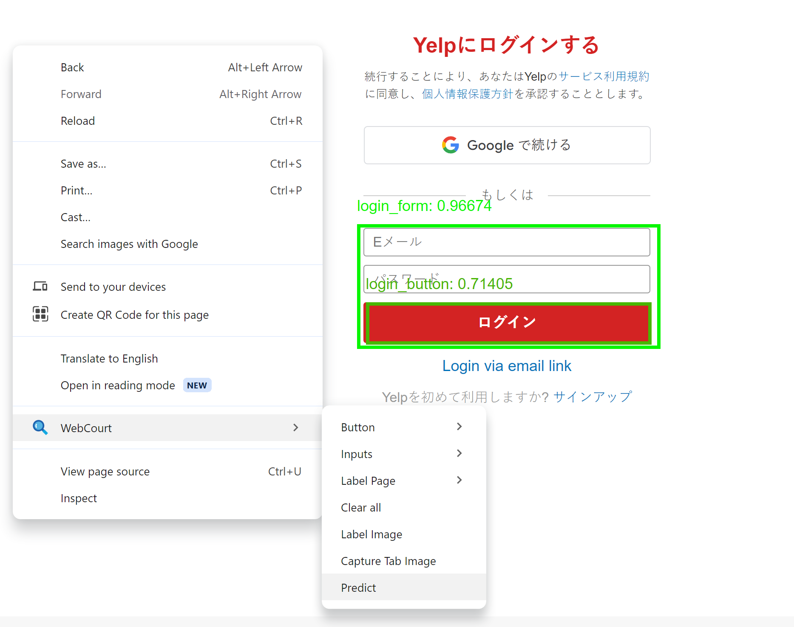

# WebCourt
1. train a yolo model with dataset of about 120 images
2. convert the pytorch yolo model to tfjs
3. use the tfjs model in browser extension

## Training

Labeling tool [labelImg](https://github.com/HumanSignal/labelImg)

Follow this [Google Colab](https://colab.research.google.com/drive/1MxZjsieH3T6Wv3np1CU9aYsTfoOnses3?usp=sharing) to train and convert to tfjs

After converted to tfjs, download and put the model in `./tf/yolo/tfjs-models/yolov8{model-size}`, e.g `./tf/yolo/tfjs-models/yolov8m`

## Extension build and usage
Currently use yolov8m model for extension
### build
1. `yarn install`
2. `yarn build.chrome.dev`
3. the extension will be built in `./tools/dist/chrome`, load it in Chrome

### usage
#### predict
1. Go to a website
2. Context menu -> WebCourt -> Predict

  

#### save and download tab screenshot
1. Go to a website
2. Context menu -> WebCourt -> Capture Tab Image
3. The Tab screenshot will be saved to extension's indexedDB, you can repeat 1 and 2 to save as many as screenshots
4. Click extension popup -> Options
5. Click `Download Images`
    - the images will be downloaded to Chrome `<current download folder>/web-court-download`
    - if no indexes specified, all screenshots will be downloaded and overwrite the existing
    - the indexes would be helpful if you have a lot of screenshots or you capture screenshots incrementally and only need to download the newly captured ones

